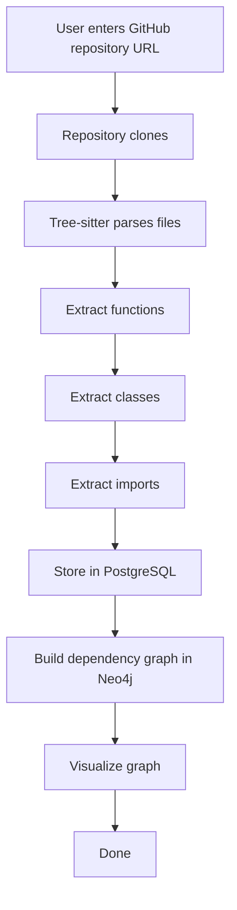

# Software DNA - Project Accomplishments & Status

This document provides a detailed overview of the accomplishments, implemented boilerplate code, and architecture design for the **Software DNA** project as of July 13, 2026.

---

## 📋 Table of Contents
1. [Project Vision](#-project-vision)
2. [Boilerplate Directory Structure](#-boilerplate-directory-structure)
3. [Implemented Features & Codebase Breakdown](#-implemented-features--codebase-breakdown)
   - [Core Backend Service (FastAPI)](#core-backend-service-fastapi)
   - [Documentation & MVP Design](#documentation--mvp-design)
   - [Automation & DevOps Scripts](#automation--devops-scripts)
4. [Research Milestones](#-research-milestones)
5. [MVP Pipeline & Scope](#-mvp-pipeline--scope)
6. [Next Steps & Planned Tasks (Roadmap)](#-next-steps--planned-tasks-roadmap)

---

## 🌐 Project Vision
**Software DNA** is an AI-powered Software Intelligence Platform designed to model software systems as living, queryable knowledge graphs. The core philosophy is to move away from viewing software as static files/folders, and instead model architecture, dependencies, and code evolution dynamically. 

---

## 📁 Boilerplate Directory Structure
The repository is set up with a modular microservice architecture structure. While many service folders are currently placeholders (containing `.gitkeep`), the structure is organized as follows:

*   **`backend/`** (Implemented API boilerplate): Core API orchestration, databases, and general app logic.
*   **`parser-service/`** (Placeholder): Code parsing, AST (Abstract Syntax Tree) generation, and metadata extraction.
*   **`graph-service/`** (Placeholder): Dependency graph construction and querying.
*   **`ai-service/`** (Placeholder): LLM integration and intelligent reasoning/insights.
*   **`analytics-service/`** (Placeholder): Code churn, complexity, and developer interaction analytics.
*   **`frontend/`** (Placeholder): Visualization dashboard and interface.
*   **`docs/`** (Implemented docs & research): Architecture diagrams, MVP scope, and developer research.
*   **`scripts/`** (Implemented automation scripts): Developer automation utilities.
*   **`tests/`** (Placeholder): Core integration and service verification.
*   **`infrastructure/`** / **`docker/`** (Placeholders): Multi-service environment configurations.
*   **`research/`** (Placeholder): Notebooks and algorithmic prototypes.

---

## 🛠️ Implemented Features & Codebase Breakdown

### Core Backend Service (FastAPI)
A production-ready Python FastAPI boilerplate has been initialized inside the `backend/` directory.

1.  **FastAPI Application Setup (`backend/app/main.py`)**:
    *   Integrates FastAPI with modern routing structure.
    *   Lifespan-based context manager handles startup (logging configuration) and shutdown procedures.
    *   Configures Cross-Origin Resource Sharing (CORS) middleware to allow client access.
2.  **Configuration Management (`backend/app/config/settings.py`)**:
    *   Utilizes Pydantic's `BaseSettings` and `SettingsConfigDict` to load configuration details from environment variables or a `.env` file automatically.
    *   Uses validation logic to dynamically compile the PostgreSQL database URI (`SQLALCHEMY_DATABASE_URI`) using connection sub-components.
3.  **Database Layer (`backend/app/database/`)**:
    *   **Engine Setup (`session.py`)**: Initializes SQLAlchemy's connection pooling with `pool_pre_ping=True` (ensures broken connections are automatically recycled) and sets optimal pool sizes.
    *   **ORM Declarative Base (`base_class.py`)**: Defines a general base class that automatically derives lowercase snake_case table names (`__tablename__`) from ORM classes.
    *   **Alembic Migration Support (`alembic.ini`, `migrations/env.py`)**: Set up for database migration schema tracking.
4.  **Data Models (`backend/app/models/repository.py`)**:
    *   Defines the `Repository` SQLAlchemy model representing imported codebases with attributes: `id`, `name`, `url`, and `created_at`.
5.  **Logging Configuration (`backend/app/core/logging.py`)**:
    *   Standardizes logging through `logging.config.dictConfig` to provide structured console logging. Configures levels for `app`, `uvicorn`, and `sqlalchemy.engine`.
6.  **API Routing & Endpoints (`backend/app/api/`)**:
    *   Modular router architecture (`router.py`) registering version-specific sub-routers.
    *   **Health Check Endpoint (`health.py`)**: Connects to the database and issues a validation statement (`SELECT 1`) to ensure both the API service and the PostgreSQL backend are fully functional.

### Documentation & MVP Design
*   **Project README (`README.md`)**: Lays out the vision, core goals, and directory descriptions.
*   **MVP Specification (`docs/mvp.md`)**: Explicitly defines what is **in scope** and **out of scope** (specifically declaring AI features as post-MVP additions to avoid scope creep).

### Automation & DevOps Scripts
*   **Issue Generation Tool (`scripts/create_github_issues.py`)**:
    *   A utility Python script that parses a checklist of 14 features and calls the GitHub API to populate issues inside the user repository `Reddy0402/software-dna` based on a supplied token (`GITHUB_TOKEN`).

---

## 🔬 Research Milestones
A dedicated research documentation folder (`docs/research/`) is configured with topic markdown files to serve as reference frames for core technologies being evaluated for Software DNA:
*   [AST Exploration](file:///c:/Users/vippa/Downloads/software%20genome/docs/research/ast.md): Syntactical parsing research.
*   [Tree-sitter Integration](file:///c:/Users/vippa/Downloads/software%20genome/docs/research/tree-sitter.md): AST extraction mechanics for multiple language backends.
*   [Neo4j Graphing](file:///c:/Users/vippa/Downloads/software%20genome/docs/research/neo4j.md): Relational & traversal storage strategies.
*   [Knowledge Graphing](file:///c:/Users/vippa/Downloads/software%20genome/docs/research/knowledge-graphs.md): Unifying codebase data into interconnected graphs.
*   [LangGraph](file:///c:/Users/vippa/Downloads/software%20genome/docs/research/langgraph.md): Agent workflows and graph-based planning.
*   [Semgrep](file:///c:/Users/vippa/Downloads/software%20genome/docs/research/semgrep.md): Semantic/rule-based code analysis.
*   [CodeQL](file:///c:/Users/vippa/Downloads/software%20genome/docs/research/codeql.md): Advanced static analysis querying.

---

## 🧬 MVP Pipeline & Scope
According to [mvp.md](file:///c:/Users/vippa/Downloads/software%20genome/docs/mvp.md), the initial MVP targets a strictly non-AI visual graph representation pipeline:

*   **Out of Scope for MVP**: Chat capabilities, AI-agent code editing, and Predictive Risk Modeling.

---

## 🗺️ Next Steps & Planned Tasks (Roadmap)
The project's planned roadmap is tracked through the following issue milestones:
1.  **Repository Import**: Sync external git links with checkout controls.
2.  **Parser Engine & AST Extraction**: Multi-language parsing with Tree-sitter.
3.  **Dependency Graph & Neo4j Integration**: Connecting classes, imports, and calls into a queryable graph.
4.  **DNA Model**: Setting up schemas defining codebases as dynamic structures.
5.  **Developer Analytics**: Calculating knowledge distribution, silos, and hotspots.
6.  **Semantic Search & AI Capabilities**: Semantic search (RAG) and interactive LLM chat dashboard.
7.  **Impact & Risk Analysis**: Simulating code modifications and predicting downstream bugs.
