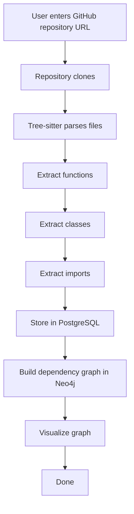

# MVP Definition

Many projects fail because the MVP is too large. Our MVP is **not AI**.

## MVP Core Flow

## Constraints (Out of Scope for MVP)

- **No chat**
- **No AI agents**
- **No predictions**

*Those come later.*
