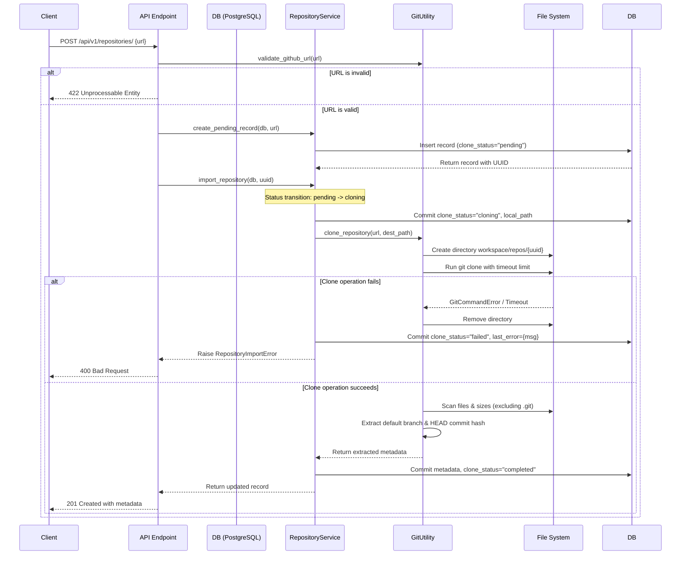

# Sprint 2 Documentation: Repository Import Service

This document describes the design, API specs, configuration properties, and usage instructions for the Repository Import Service.

---

## 📡 REST API Specifications

### Import a GitHub Repository
*   **Path:** `POST /api/v1/repositories/`
*   **Content-Type:** `application/json`
*   **Status Code:** `201 Created`

#### Request Schema (`RepositoryCreate`)
```json
{
  "url": "https://github.com/Reddy0402/software-dna"
}
```
*Note: The URL must be a valid, standard GitHub repository link. Format validation is performed using a field validator before any checkout executes.*

#### Response Schema (`RepositoryResponse`)
```json
{
  "id": "c13840cf-795a-4934-8c46-9289569fae48",
  "name": "software-dna",
  "url": "https://github.com/Reddy0402/software-dna",
  "local_path": "/workspace/repos/c13840cf-795a-4934-8c46-9289569fae48",
  "clone_status": "completed",
  "owner": "Reddy0402",
  "default_branch": "main",
  "parser_status": "pending",
  "graph_status": "pending",
  "last_error": null,
  "size_bytes": 128450,
  "latest_commit_hash": "a4d3e2...90c4d2",
  "total_files": 42,
  "created_at": "2026-07-14T10:00:00.123456",
  "updated_at": "2026-07-14T10:00:01.654321"
}
```

---

## ⚙️ Configuration & Environment Variables
The following environment variables can be set inside `.env` or in the host environment to customize import settings:

| Variable Name | Type | Default Value | Description |
| :--- | :--- | :--- | :--- |
| `WORKSPACE_BASE_DIR` | `str` | `"workspace/repos"` | The local relative or absolute directory path where repositories are cloned. |
| `GIT_CLONE_TIMEOUT` | `int` | `300` | Process execution timeout in seconds for repository clone operations. |
| `GIT_EXECUTABLE` | `str` | `None` | Custom system path for git executable overrides. |

---

## 📂 Workspace Directory Structure
When a repository is imported, it is checked out into a dedicated subfolder using its UUID to prevent path collisions:

```text
workspace/
└── repos/
    └── {repository_uuid}/
        ├── .git/
        ├── app/
        ├── README.md
        └── ... (cloned files)
```

---

## 🔄 Core Import Workflow



---

## 🧪 Testing Instructions
The test suite utilizes an in-memory SQLite configuration to execute tests offline without needing PostgreSQL running.

To run the unit and integration tests, run the following command from the project root directory:
```powershell
pytest tests/
```
