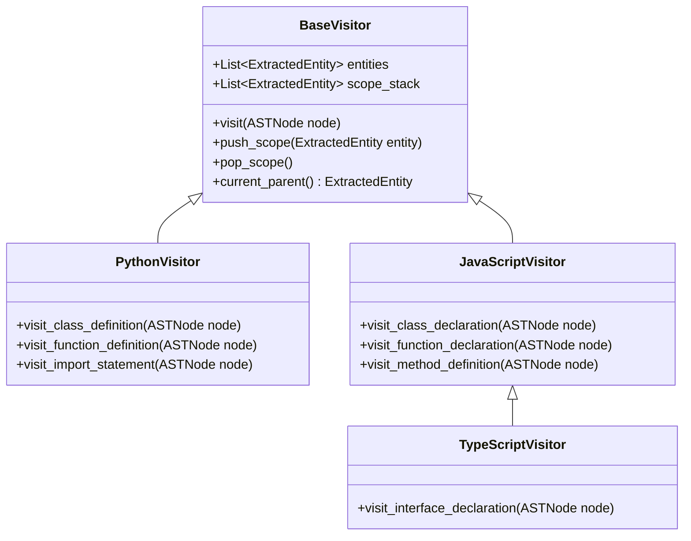

# Sprint 3 Part 3 Documentation: Metadata Extraction Engine

This document outlines the database schema, visitor traversal architecture, Pydantic serialization schemas, and REST endpoint for the Metadata Extraction Engine.

---

## 💾 Database Schema: `code_entity` Table

The extracted metadata maps programming constructs into a normalized relational format inside PostgreSQL:

| Column Name | SQLAlchemy Type | Constraints | Description |
| :--- | :--- | :--- | :--- |
| `id` | `UUID` | Primary Key, Index | Unique identifier for each entity. |
| `repository_id` | `UUID` | ForeignKey, Nullable=False, Index | Links to parent Repository. Cascades delete. |
| `file_id` | `UUID` | ForeignKey, Nullable=False, Index | Links to parent scanned File. Cascades delete. |
| `parent_id` | `UUID` | ForeignKey, Nullable=True, Index | Self-referencing link to parent entity scope (nesting). |
| `entity_type` | `String(50)` | Nullable=False | Construct category: `class`, `interface`, `method`, etc. |
| `name` | `String(255)` | Nullable=False | Short/Simple name (e.g. `greet`). |
| `fully_qualified_name`| `String(1024)`| Nullable=False | Dot-scoped namespace path (e.g. `utils.Greeter.greet`). |
| `start_line` | `Integer` | Nullable=False | 0-indexed start row. |
| `end_line` | `Integer` | Nullable=False | 0-indexed end row. |
| `visibility` | `String(50)` | Nullable=True, Default="public"| Access scoping: `public`, `private`, `protected`. |
| `language` | `String(50)` | Nullable=False | Source file language. |
| `meta_data` | `JSON` | Nullable=True | Custom dynamic fields (decorators, parameters, bases). |

---

## 📡 REST API Specifications

### Extract Metadata from Scanned File
*   **Path:** `POST /api/v1/files/{file_id}/extract`
*   **Content-Type:** `application/json`
*   **Status Code:** `200 OK`

#### Response JSON Schema (Array of objects)
```json
[
  {
    "id": "e4f5012e-128a-40a2-895c-9c3db89d53c7",
    "repository_id": "7ac1d2ab-cb41-45bd-85d2-fdfb9da3a812",
    "file_id": "785aff28-1cd9-405a-85d2-fdfb9da3a812",
    "parent_id": null,
    "entity_type": "class",
    "name": "Calculator",
    "fully_qualified_name": "maths.Calculator",
    "start_line": 0,
    "end_line": 3,
    "visibility": "public",
    "language": "Python",
    "meta_data": {
      "bases": []
    }
  },
  {
    "id": "215d8961-cd90-40a2-895c-9c3db89d53c7",
    "repository_id": "7ac1d2ab-cb41-45bd-85d2-fdfb9da3a812",
    "file_id": "785aff28-1cd9-405a-85d2-fdfb9da3a812",
    "parent_id": "e4f5012e-128a-40a2-895c-9c3db89d53c7",
    "entity_type": "method",
    "name": "add",
    "fully_qualified_name": "maths.Calculator.add",
    "start_line": 1,
    "end_line": 2,
    "visibility": "public",
    "language": "Python",
    "meta_data": {
      "parameters": ["self", "a", "b"]
    }
  }
]
```

---

## 🧱 Extractor Visitor Architecture

The extractor employs a visitor pattern traversal walking the Python `ASTNode` tree rather than raw Tree-sitter C-nodes. 



### Scope Traversal & FQN Calculation
*   When a structural boundary is encountered (e.g. `class_definition`), the visitor instantiates an `ExtractedEntity` and calls `push_scope()`, appending the entity to the active hierarchy stack.
*   Child nodes encountered under this recursive context are linked with their parent entity.
*   At completion, fully qualified names are calculated by walking up the entity parent chain, appending file-module contexts.
