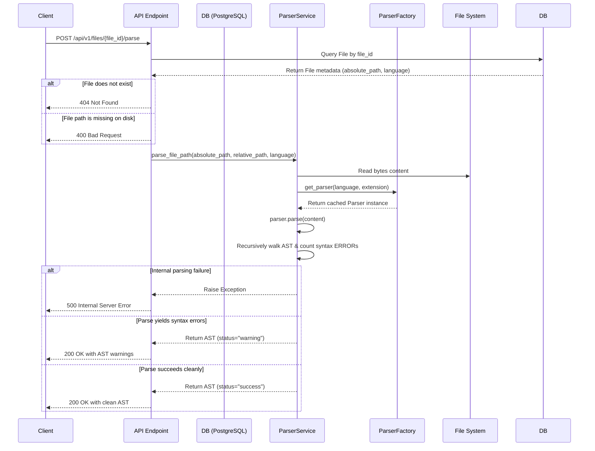

# Sprint 3 Part 2 Documentation: Tree-sitter Parser Engine

This document outlines the design, serialization format, factory caching, and REST endpoint for the Tree-sitter Parser Engine.

---

## 📡 REST API Specifications

### Parse a Scanned File
*   **Path:** `POST /api/v1/files/{file_id}/parse`
*   **Content-Type:** `application/json`
*   **Status Code:** `200 OK`

#### Response JSON Schema
```json
{
  "filename": "hello.py",
  "relative_path": "hello.py",
  "language": "Python",
  "status": "success",
  "syntax_errors_count": 0,
  "root_node_id": 0,
  "nodes": [
    {
      "id": 0,
      "type": "module",
      "text": "def greet():\n    print('hello')",
      "start_line": 0,
      "end_line": 1,
      "start_column": 0,
      "end_column": 18,
      "parent_id": null,
      "child_ids": [1]
    },
    {
      "id": 1,
      "type": "function_definition",
      "text": "def greet():\n    print('hello')",
      "start_line": 0,
      "end_line": 1,
      "start_column": 0,
      "end_column": 18,
      "parent_id": 0,
      "child_ids": [2, 3, 4]
    }
  ]
}
```
*Note: Due to circular references between parent and children nodes, the AST is serialized as a flat list under the key `nodes` where each node exposes `parent_id` and `child_ids` keys. This allows fast traverse operations and safe JSON serialization.*

---

## ⚙️ Grammars and Packages
The parser loads grammars dynamically from the following precompiled Python wheel packages:

*   **Python:** `tree-sitter-python`
*   **JavaScript:** `tree-sitter-javascript`
*   **TypeScript / TSX:** `tree-sitter-typescript` (exposes `language_typescript` and `language_tsx`)
*   **Java:** `tree-sitter-java`
*   **C++:** `tree-sitter-cpp`
*   **C:** `tree-sitter-c`
*   **Go:** `tree-sitter-go`
*   **Rust:** `tree-sitter-rust`
*   **C#:** `tree-sitter-c-sharp`

---

## ⚡ Performance Optimizations
1.  **Grammar & Parser Caching:** Caches `Language` and `Parser` instances inside the `ParserFactory` singleton. Multiple files belonging to the same programming language reuse the exact same parser instance, avoiding repeated garbage collection and C-binding initialization cycles.
2.  **In-Memory Reference Traversals:** The in-memory tree is linked via `parent` and `children` properties, allowing quick traverse passes in python. It is only flattened during serialization.
3.  **Fast JSON Serialization:** Bypassing complex Pydantic validation loops for deep AST structures in API responses by returning flat dictionary trees directly.

---

## 🔄 Parsing Sequence & Error Policy



---

## 🧪 Testing Coverage
Run the full test suite (including scanner and parser tests) using:
```powershell
python -m pytest tests/
```
Parser tests verify standard parsing, syntax error warning states, empty files, TSX vs TS configurations, and API integration.
