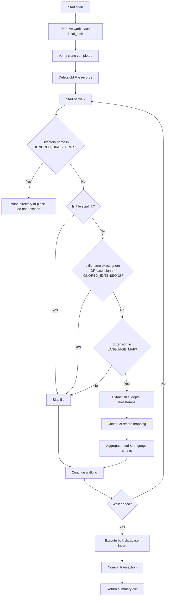

# Sprint 3 Part 1 Documentation: Repository Scanner

This document describes the design, API specifications, settings, and implementation details for the Repository Scanner module.

---

## 📡 REST API Specifications

### Scan an Imported Repository
*   **Path:** `POST /api/v1/repositories/{repository_id}/scan`
*   **Content-Type:** `application/json`
*   **Status Code:** `200 OK`

#### Response Schema (`ScanSummaryResponse`)
```json
{
  "repository_id": "c13840cf-795a-4934-8c46-9289569fae48",
  "total_files_scanned": 150,
  "supported_files_found": 88,
  "language_distribution": {
    "Python": 50,
    "TypeScript": 38
  }
}
```

---

## ⚙️ Configuration Properties
The scanner uses environment variables inside Pydantic `Settings` to identify supported languages and avoid entering binary or packages folders.

| Setting Name | Type | Defaults | Description |
| :--- | :--- | :--- | :--- |
| `LANGUAGE_MAP` | `dict` | Exts to Py, JS, TS, Java, Go, Rust, C#, C++, C | Maps lowercase extensions to language names. |
| `IGNORED_DIRECTORIES` | `list` | `.git`, `.github`, `node_modules`, `venv`, `.venv`, `dist`, `build`, `target`, `bin`, `obj`, `coverage`, `.idea`, `.vscode`, `__pycache__`, `.pytest_cache`, `.mypy_cache`, `.next`, `.nuxt`, `.terraform` | Skips walking directories matching these names (case-insensitive). |
| `IGNORED_EXTENSIONS` | `list` | Zips, binaries, images, video formats, `.lock` | Excludes files matching these extensions. |
| `IGNORED_FILENAMES` | `list` | `package-lock.json`, `yarn.lock`, `pnpm-lock.yaml`, `cargo.lock`, `poetry.lock`, `composer.lock`, `mix.lock`, `paket.lock` | Excludes exact matches. |

---

## 📂 File Database Model Schema (`File`)
Discovered files are saved to the `file` database table:

*   `id` (UUID, Primary Key)
*   `repository_id` (UUID, Foreign Key referencing `repository.id` with `CASCADE` delete)
*   `absolute_path` (String(1024), Non-nullable)
*   `relative_path` (String(1024), Non-nullable)
*   `filename` (String(255), Non-nullable)
*   `extension` (String(50), Non-nullable)
*   `language` (String(50), Non-nullable)
*   `depth` (Integer, Non-nullable)
*   `size_bytes` (BigInteger, Non-nullable)
*   `last_modified` (DateTime, Non-nullable)

---

## 🔄 Scanning Traversal & Pruning Flow



---

## 🧪 Testing Coverage
Tests run against SQLite in-memory databases locally:
```powershell
pytest tests/
```
Tests check ignored directories walking, lock files, binary skips, symbolic links ignores, and DB counts.
