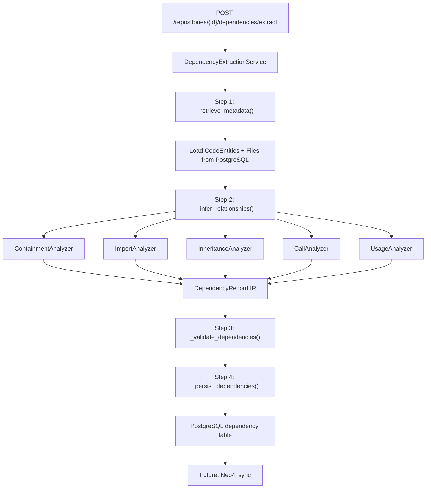
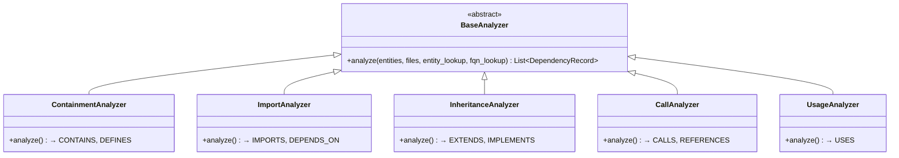

# Sprint 4 Part 1 Documentation: Dependency Extraction Engine

This document covers the database schema, REST API specifications, analyzer architecture, and extraction pipeline for the Dependency Extraction Engine.

---

## 💾 Database Schema: `dependency` Table

Extracted dependency relationships are stored in a normalized relational format inside PostgreSQL:

| Column Name | SQLAlchemy Type | Constraints | Description |
| :--- | :--- | :--- | :--- |
| `id` | `UUID` | Primary Key, Index | Unique identifier for each dependency edge. |
| `repository_id` | `UUID` | ForeignKey → `repository.id`, Cascades delete, Index | Scopes the dependency to a repository. |
| `source_entity_id` | `UUID` | ForeignKey → `code_entity.id`, Cascades delete, Index | The entity at the origin of the relationship. |
| `target_entity_id` | `UUID` | ForeignKey → `code_entity.id`, SET NULL, Nullable, Index | The entity at the destination (nullable for unresolved external refs). |
| `relationship_type` | `String(50)` | Not Null, Index | Edge type: `IMPORTS`, `CALLS`, `DEFINES`, `CONTAINS`, `EXTENDS`, `IMPLEMENTS`, `USES`, `DEPENDS_ON`, `REFERENCES`. |
| `confidence` | `Float` | Not Null, Default 1.0 | Confidence score 0.0–1.0 indicating extraction certainty. |
| `source_file` | `String(1024)` | Not Null | Relative path of the file where the relationship originates. |
| `line_number` | `Integer` | Not Null, Default 0 | Line number where the relationship was detected. |
| `target_fqn` | `String(1024)` | Nullable | Fully qualified name of the target (for unresolved/external refs). |
| `meta_data` | `JSON` | Nullable | Additional relationship context (import alias, decorator name, etc.). |
| `created_at` | `DateTime` | Default utcnow | Timestamp of creation. |

---

## 📡 REST API Specifications

### Extract Dependencies for a Repository
*   **Path:** `POST /api/v1/repositories/{repository_id}/dependencies/extract`
*   **Content-Type:** `application/json`
*   **Status Code:** `200 OK`

#### Response JSON Schema
```json
{
  "repository_id": "7ac1d2ab-cb41-45bd-85d2-fdfb9da3a812",
  "total_dependencies": 42,
  "by_relationship_type": {
    "CONTAINS": 12,
    "DEFINES": 12,
    "EXTENDS": 3,
    "IMPORTS": 8,
    "DEPENDS_ON": 4,
    "CALLS": 3
  },
  "avg_confidence": 0.912,
  "unresolved_count": 5
}
```

### List Extracted Dependencies
*   **Path:** `GET /api/v1/repositories/{repository_id}/dependencies`
*   **Query Parameters:**
    *   `relationship_type` (optional): Filter by edge type
    *   `skip` (default: 0): Pagination offset
    *   `limit` (default: 100, max: 500): Pagination limit
*   **Status Code:** `200 OK`

#### Response JSON Schema (Array)
```json
[
  {
    "id": "a1b2c3d4-...",
    "repository_id": "7ac1d2ab-...",
    "source_entity_id": "e4f5012e-...",
    "target_entity_id": "215d8961-...",
    "relationship_type": "CONTAINS",
    "confidence": 1.0,
    "source_file": "src/models.py",
    "line_number": 5,
    "target_fqn": "models.User.get_name",
    "meta_data": {
      "parent_type": "class",
      "child_type": "method"
    },
    "created_at": "2026-07-15T06:00:00Z"
  }
]
```

---

## 🧱 Extraction Pipeline Architecture

The extraction engine follows a 4-step modular pipeline:



### Pipeline Steps

| Step | Method | Description |
| :--- | :--- | :--- |
| 1 | `_retrieve_metadata()` | Fetches all `CodeEntity` and `File` records for the repository. |
| 2 | `_infer_relationships()` | Runs all registered analyzers against the entity/file dataset. |
| 3 | `_validate_dependencies()` | Deduplicates, validates relationship types, clamps confidence. |
| 4 | `_persist_dependencies()` | Clears old dependencies and bulk-inserts validated records. |

---

## 🔍 Analyzer Architecture



### Analyzer Details

| Analyzer | Relationships | Confidence | Strategy |
| :--- | :--- | :--- | :--- |
| **ContainmentAnalyzer** | `CONTAINS`, `DEFINES` | 1.0 (structural) | Reads parent_id hierarchy from CodeEntity. |
| **ImportAnalyzer** | `IMPORTS`, `DEPENDS_ON` | 0.5–1.0 | Resolves import targets via FQN lookup, file-module path matching, partial matching. |
| **InheritanceAnalyzer** | `EXTENDS`, `IMPLEMENTS` | 0.7–1.0 | Reads `bases` and `implements` from entity meta_data. Distinguishes interfaces from classes. |
| **CallAnalyzer** | `CALLS`, `REFERENCES` | 0.4–0.9 | Reads `calls` and `references` from meta_data. Detects recursive self-calls. |
| **UsageAnalyzer** | `USES` | 0.4–0.8 | Reads decorators, return types, and parameter types from meta_data. |

### Language-Independent Intermediate Representation

All analyzers produce `DependencyRecord` dataclass instances:

```python
@dataclass
class DependencyRecord:
    repository_id: UUID
    source_entity_id: UUID
    target_entity_id: Optional[UUID]
    relationship_type: str
    confidence: float
    source_file: str
    line_number: int
    target_fqn: str
    meta_data: Dict
```

---

## ✅ Test Coverage

| Test Class | Scenarios | Count |
| :--- | :--- | :--- |
| `TestContainmentAnalyzer` | Class→method CONTAINS, nested class chains | 2 |
| `TestInheritanceAnalyzer` | Python EXTENDS, multiple inheritance, unresolved bases, interface IMPLEMENTS, Java explicit implements | 5 |
| `TestImportAnalyzer` | Basic import, cross-file resolution, circular imports | 3 |
| `TestCallAnalyzer` | Recursive self-calls, function→function calls, explicit references | 3 |
| `TestUsageAnalyzer` | Decorator usage, return type usage | 2 |
| `TestDependencyExtractionService` | Full pipeline, pipeline with inheritance, empty repo, nonexistent repo, re-extraction idempotency | 5 |
| `TestValidation` | Duplicate removal, invalid type filtering, confidence clamping | 3 |
| `TestAnalyzerRegistry` | All analyzers registered, unique key consistency | 2 |
| `TestLanguagePatterns` | Python `__init__` DEFINES, Go struct methods | 2 |
| `TestAPIEndpoints` | Extract endpoint, list endpoint, type filter, nonexistent repo error | 4 |
| **Total** | | **31** |

---

## 📦 Files Modified/Created

### New Files
*   `backend/app/models/dependency.py` — Dependency SQLAlchemy model
*   `backend/app/schemas/dependency.py` — Pydantic response schemas
*   `backend/app/services/analyzers/__init__.py` — Base analyzer framework + registry
*   `backend/app/services/analyzers/containment_analyzer.py` — CONTAINS/DEFINES
*   `backend/app/services/analyzers/import_analyzer.py` — IMPORTS/DEPENDS_ON
*   `backend/app/services/analyzers/inheritance_analyzer.py` — EXTENDS/IMPLEMENTS
*   `backend/app/services/analyzers/call_analyzer.py` — CALLS/REFERENCES
*   `backend/app/services/analyzers/usage_analyzer.py` — USES
*   `backend/app/services/dependency_extractor.py` — Extraction pipeline orchestrator
*   `backend/app/api/v1/endpoints/dependencies.py` — REST API endpoints
*   `tests/test_dependency_extractor.py` — Comprehensive test suite (31 tests)

### Modified Files
*   `backend/app/models/base.py` — Registered Dependency for Alembic
*   `backend/app/models/__init__.py` — Exported Dependency
*   `backend/app/models/repository.py` — Added `dependencies` relationship
*   `backend/app/models/code_entity.py` — Added `source_dependencies` / `target_dependencies`
*   `backend/app/core/exceptions.py` — Added `DependencyExtractionError`
*   `backend/app/api/v1/router.py` — Registered dependencies router
