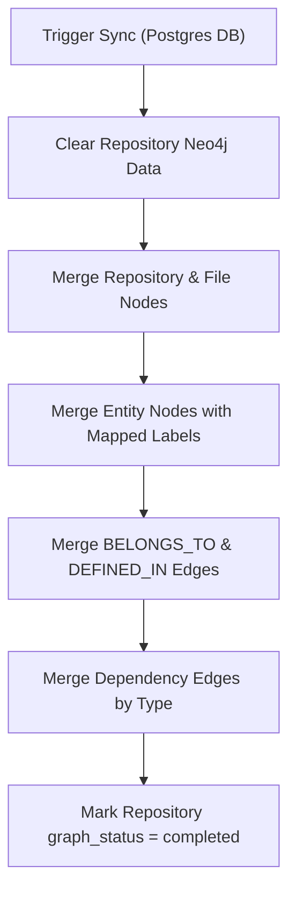

# Sprint 4 Part 2 Documentation: Neo4j Graph Synchronization Service

This document describes the design, database mapping, API specifications, and querying mechanisms for synchronizing Software DNA models to Neo4j.

---

## 💾 Graph Database Schema

We represent repository structures, files, code entities, and extraction relationships as a property graph in Neo4j.

### Node Labels

Nodes represent structural elements in a codebase. They are all marked with the general label `Entity` (except `Repository` and `File`) and additional language-independent type labels:

| Primary Label | Secondary Labels | Properties |
| :--- | :--- | :--- |
| `Repository` | — | `id` (UUID), `name` (String), `url` (String), `owner` (String) |
| `File` | — | `id` (UUID), `relative_path` (String), `filename` (String), `extension` (String), `language` (String), `size_bytes` (Integer) |
| `Entity` | `Class` | `id` (UUID), `name` (String), `fully_qualified_name` (String), `visibility` (String), `language` (String), `start_line` (Integer), `end_line` (Integer) |
| `Entity` | `Interface` | `id` (UUID), `name` (String), `fully_qualified_name` (String), `visibility` (String), `language` (String), `start_line` (Integer), `end_line` (Integer) |
| `Entity` | `Function` | `id` (UUID), `name` (String), `fully_qualified_name` (String), `visibility` (String), `language` (String), `start_line` (Integer), `end_line` (Integer) |
| `Entity` | `Method` | `id` (UUID), `name` (String), `fully_qualified_name` (String), `visibility` (String), `language` (String), `start_line` (Integer), `end_line` (Integer) |
| `Entity` | `Import` | `id` (UUID), `name` (String), `fully_qualified_name` (String), `visibility` (String), `language` (String), `start_line` (Integer), `end_line` (Integer) |
| `Entity` | `Module` | `id` (UUID), `name` (String), `fully_qualified_name` (String), `visibility` (String), `language` (String), `start_line` (Integer), `end_line` (Integer) (Generic fallback for struct, namespace, constructor, etc.) |
| `Entity` | `External` | `id` (UUID), `name` (String), `fully_qualified_name` (String) (Created as placeholder for unresolved target dependencies) |

### Relationship Types

Edges in the graph represent syntactical or dependency relationships:

| Relationship Type | Direction | Properties | Description |
| :--- | :--- | :--- | :--- |
| `BELONGS_TO` | `File` ➔ `Repository` | — | Structural relationship connecting files to their repository. |
| `DEFINED_IN` | `Entity` ➔ `File` | — | Structural relationship linking code entities to their source file. |
| `CONTAINS` | `Entity` ➔ `Entity` | `id`, `confidence`, `source_file`, `line_number`, `meta_data` | Nesting scope. e.g., Class contains Method. |
| `DEFINES` | `Entity` ➔ `Entity` | `id`, `confidence`, `source_file`, `line_number`, `meta_data` | Structural definition relationship. |
| `IMPORTS` | `Entity` ➔ `Entity` | `id`, `confidence`, `source_file`, `line_number`, `meta_data` | Import reference between entities. |
| `CALLS` | `Entity` ➔ `Entity` | `id`, `confidence`, `source_file`, `line_number`, `meta_data` | Function/method invocation. |
| `EXTENDS` | `Entity` ➔ `Entity` | `id`, `confidence`, `source_file`, `line_number`, `meta_data` | Inheritance mapping. |
| `IMPLEMENTS` | `Entity` ➔ `Entity` | `id`, `confidence`, `source_file`, `line_number`, `meta_data` | Class implementing an interface. |
| `USES` | `Entity` ➔ `Entity` | `id`, `confidence`, `source_file`, `line_number`, `meta_data` | Type usage or annotations. |
| `DEPENDS_ON` | `Entity` ➔ `Entity` | `id`, `confidence`, `source_file`, `line_number`, `meta_data` | Inter-file module dependencies. |
| `REFERENCES` | `Entity` ➔ `Entity` | `id`, `confidence`, `source_file`, `line_number`, `meta_data` | Loose symbol/reference mapping. |

---

## 📡 REST API Specifications

### Synchronize Repository to Neo4j
*   **Path:** `POST /api/v1/repositories/{repository_id}/graph/sync`
*   **Status Code:** `200 OK`
*   **Response:**
    ```json
    {
      "repository_id": "7ac1d2ab-cb41-45bd-85d2-fdfb9da3a812",
      "status": "completed",
      "files_synced": 5,
      "entities_synced": 12,
      "dependencies_synced": 20
    }
    ```

### Get Graph Summary Statistics
*   **Path:** `GET /api/v1/repositories/{repository_id}/graph/summary`
*   **Response:**
    ```json
    {
      "repository_id": "7ac1d2ab-cb41-45bd-85d2-fdfb9da3a812",
      "total_nodes": 17,
      "total_edges": 25,
      "nodes_by_label": {
        "Class": 3,
        "Method": 8,
        "Function": 4,
        "Import": 2
      },
      "edges_by_type": {
        "CONTAINS": 11,
        "DEFINES": 11,
        "CALLS": 3
      }
    }
    ```

### Get Entity Dependencies
*   **Path:** `GET /api/v1/repositories/{repository_id}/graph/entity/{entity_id}/dependencies`
*   **Response:** Direct inbound and outbound dependency nodes/edges.

### Get Downstream Dependency Chain
*   **Path:** `GET /api/v1/repositories/{repository_id}/graph/entity/{entity_id}/chain`
*   **Query Parameters:** `depth` (1 to 5, default 3)
*   **Response:** Subgraph of transitive dependencies.

### Find Shortest Path
*   **Path:** `GET /api/v1/repositories/{repository_id}/graph/path`
*   **Query Parameters:** `source_id`, `target_id`
*   **Response:** List of nodes and edges connecting them.

### Detect Circular Dependencies
*   **Path:** `GET /api/v1/repositories/{repository_id}/graph/cycles`
*   **Response:** List of circular reference paths found in the graph.

---

## 🧱 Graph Synchronization Pipeline

The synchronization pipeline executes inside transactions in the following order:



Idempotency is guaranteed by using the Cypher `MERGE` clause matching on unique PostgreSQL UUID properties.
Unresolved target references are handled by merging a placeholder `:External` node in Neo4j, preventing broken graphs.
